# 🌍 RPA - Sistema de Consulta de Países

<div align="center">


Um sistema de automação robótica de processos (RPA) para consultar, processar e armazenar informações de países através da API REST Countries.

[Funcionalidades](#-funcionalidades) • [Instalação](#-instalação) • [Uso](#-uso) • [Estrutura](#-estrutura-do-projeto) • [Tecnologias](#-tecnologias)

</div>

---

## 📋 Sobre o Projeto

Este projeto foi desenvolvido como parte da disciplina de **Robotic Process Automation (RPA)**. O sistema automatiza o processo de:

1. 📝 Coletar nomes de países do usuário
2. 🌐 Buscar informações detalhadas na API REST Countries
3. 🔍 Filtrar e processar os dados recebidos
4. 💾 Armazenar no banco de dados SQLite
5. ✅ Validar duplicatas antes de inserir

---

## ✨ Funcionalidades

- ✅ **Consulta Automatizada**: Busca dados de 3 países por execução
- ✅ **API REST Countries**: Integração com API pública usando endpoints `/translation` e `/name`
- ✅ **Suporte Multilíngue**: Aceita nomes de países em português (com acento) e inglês
- ✅ **Banco de Dados Local**: Armazenamento em SQLite na pasta `data/`
- ✅ **Validação de Duplicatas**: Impede inserção de países já cadastrados
- ✅ **Filtro por Correspondência Exata**: Seleciona automaticamente o país correto em casos de múltiplos resultados
- ✅ **Feedback Visual**: Mensagens informando status das operações em tempo real

---

## 🚀 Instalação

### Pré-requisitos

- Python 3.8 ou superior
- pip (gerenciador de pacotes Python)

### Passo a passo

1. **Clone o repositório**
```bash
git clone https://github.com/Impacta-Projetos/Ap2-RPA.git
cd Ap2-RPA
```

2. **Instale as dependências**
```bash
pip install -r requirements.txt
```

3. **Execute o programa**
```bash
python main.py
```

---

## 💻 Uso

### Execução Principal

```bash
python main.py
```

**Exemplo de interação:**

```
Digite o nome do 1º país: brasil
Digite o nome do 2º país: china
Digite o nome do 3º país: japão

✓ País 'brasil' inserido com sucesso!
✓ País 'china' inserido com sucesso!
✓ País 'japão' inserido com sucesso!
```

---

## Estrutura do Projeto


O projeto segue uma arquitetura modular organizada em camadas funcionais distintas, facilitando manutenção e evolução do sistema.

---

## 🗄️ Estrutura do Banco de Dados

### Tabela: `paises`

| Campo              | Tipo    | Descrição                          |
|--------------------|---------|------------------------------------|
| `id`               | INTEGER | Chave primária (auto incremento)  |
| `nome_comum`       | TEXT    | Nome comum do país                 |
| `nome_oficial`     | TEXT    | Nome oficial completo              |
| `capital`          | TEXT    | Capital do país                    |
| `continente`       | TEXT    | Continente onde se localiza        |
| `regiao`           | TEXT    | Região geográfica                  |
| `subregiao`        | TEXT    | Sub-região específica              |
| `populacao`        | INTEGER | População total                    |
| `area`             | REAL    | Área territorial (km²)             |
| `moeda_nome`       | TEXT    | Nome da moeda oficial              |
| `moeda_simbolo`    | TEXT    | Símbolo da moeda                   |
| `idioma_principal` | TEXT    | Idioma principal                   |
| `fuso_horario`     | TEXT    | Fuso horário principal             |
| `bandeira_url`     | TEXT    | URL da imagem da bandeira          |

---

## 🛠️ Tecnologias

### Core

- **[Python 3.13](https://www.python.org/)** - Linguagem principal
- **[SQLite3](https://www.sqlite.org/)** - Banco de dados relacional
- **[REST Countries API](https://restcountries.com/)** - API de dados geográficos

### Bibliotecas

- **[Requests](https://requests.readthedocs.io/)** - Requisições HTTP

---

## 🌐 Como Funciona a Busca

### Nomes Aceitos

O sistema aceita nomes de países em:

- ✅ **Português com acento**: França, México, Japão, Suíça
- ✅ **Inglês**: France, Mexico, Japan, Switzerland  
- ✅ **Nomes compostos**: Estados Unidos, Reino Unido, África do Sul

### Exemplos de Busca

| Nome Digitado | País Retornado | Status |
|---------------|----------------|--------|
| `china` | China (People's Republic of China) | ✅ |
| `frança` | France (French Republic) | ✅ |
| `estados unidos` | United States | ✅ |
| `japão` | Japan | ✅ |
| `mexico` | Mexico | ✅ |
| `alemanha` | Germany | ✅ |

### Limitações

- ❌ Apelidos não oficiais (ex: "EUA", "Inglaterra") não são reconhecidos pela API
- ❌ Nomes sem acento em português (ex: "franca", "japao") podem não funcionar
- ✅ **Recomendação**: Digite o nome completo com acentuação correta
  
---

## 🎯 Funcionalidades Técnicas

### Busca Inteligente com Dois Endpoints

O sistema utiliza dois endpoints da API REST Countries para máxima compatibilidade:

1. **`/translation/{pais}`** - Busca por nomes traduzidos (aceita português)
   - Permite buscar "França", "México", "Japão" diretamente
   - Retorna países que contêm o termo buscado em suas traduções

2. **`/name/{pais}`** - Fallback para nomes em inglês
   - Usado quando o endpoint de tradução falha
   - Garante compatibilidade com nomes em inglês

```python
# Busca primeiro por tradução, depois por nome em inglês
url_translation = f"https://restcountries.com/v3.1/translation/{pais}"
# Se falhar, tenta: 
url_name = f"https://restcountries.com/v3.1/name/{pais}"
```

### Filtro por Correspondência Exata

Quando a API retorna múltiplos países (ex: "China" e "Taiwan" para busca "china"), o sistema:

1. Compara o termo pesquisado com:
   - Nome comum em inglês
   - Nome oficial
   - Tradução em português
2. Se encontrar **correspondência exata**, usa esse país
3. Caso contrário, usa o primeiro resultado

```python
# Exemplo: Busca por "china"
# Verifica: nome_pt.lower() == "china" 
# ✅ Retorna: China (People's Republic of China)
# ❌ Ignora: Taiwan (Republic of China)
```

### Validação de Duplicatas

Antes de inserir um país, o sistema verifica se já existe:

```python
cursor.execute('SELECT id FROM paises WHERE nome_comum = ?', (nome_pais,))
if cursor.fetchone():
    print("⚠ País já existe no banco de dados!")
```

### Tratamento de Erros

- ✅ API indisponível ou país não encontrado
- ✅ Dados incompletos na resposta da API
- ✅ Duplicatas no banco de dados
- ✅ Criação automática do diretório `data/`

---

## 📊 Dados Coletados

Para cada país, são extraídos **13 campos** da API:

| Categoria         | Campos                                          |
|-------------------|-------------------------------------------------|
| **Identificação** | Nome comum, Nome oficial                        |
| **Localização**   | Capital, Continente, Região, Sub-região         |
| **Demografia**    | População                                       |
| **Geografia**     | Área territorial                                |
| **Economia**      | Moeda (nome e símbolo)                          |
| **Cultura**       | Idioma principal                                |
| **Outros**        | Fuso horário, URL da bandeira                   |

---

## 📝 Exemplos de Uso

### Caso 1: Primeira Execução

```bash
$ python main.py
Digite o nome completo do 1º país que deseja buscar: Brasil
Digite o nome completo do 2º país que deseja buscar: China
Digite o nome completo do 3º país que deseja buscar: Japão

✓ País 'brasil' inserido com sucesso!
✓ País 'china' inserido com sucesso!
✓ País 'japão' inserido com sucesso!
```

**Observação**: O sistema aceita nomes em português (com ou sem acento) e inglês.

### Caso 2: Tentativa de Duplicata

```bash
$ python main.py
Digite o nome completo do 1º país que deseja buscar: Brasil
Digite o nome completo do 2º país que deseja buscar: Alemanha
Digite o nome completo do 3º país que deseja buscar: México

⚠ País 'brasil' já existe no banco de dados!
✓ País 'alemanha' inserido com sucesso!
✓ País 'méxico' inserido com sucesso!
```

### Caso 3: País Não Encontrado

```bash
$ python main.py
Digite o nome completo do 1º país que deseja buscar: xyzabc
Digite o nome completo do 2º país que deseja buscar: Portugal
Digite o nome completo do 3º país que deseja buscar: Espanha

✗ Não foi possível obter dados para 'xyzabc'
✓ País 'portugal' inserido com sucesso!
✓ País 'espanha' inserido com sucesso!
```

---

## 🎬 Pipeline Visual do Sistema

Esta seção apresenta o fluxo completo de execução do sistema através de imagens que demonstram cada etapa do processo.

### P1 - Código Principal e Imports
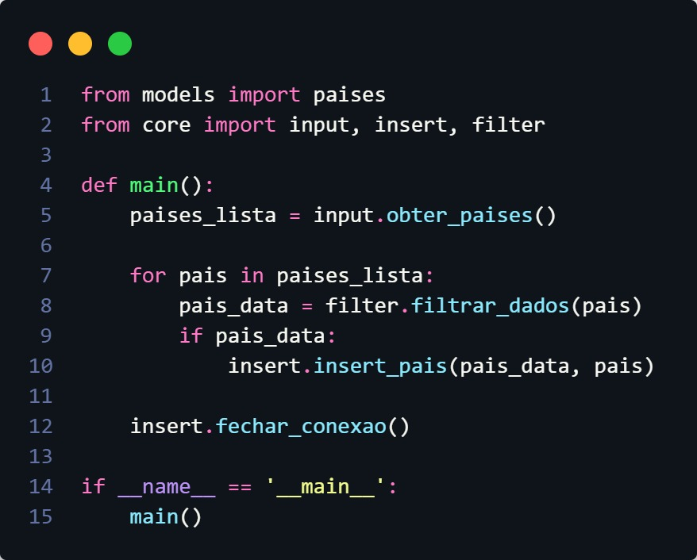

O sistema inicia com o código principal (`main.py`) executando os imports necessários dos módulos `paises` e dos arquivos do `core` (input, filter, insert).

### P2 - Criação e Conexão com o Banco de Dados
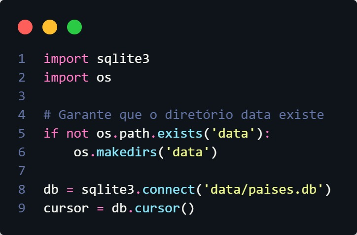

O banco de dados SQLite é criado automaticamente na pasta `data/` e a conexão é estabelecida para preparar o ambiente de armazenamento.

### P3 - Estrutura da Tabela Países
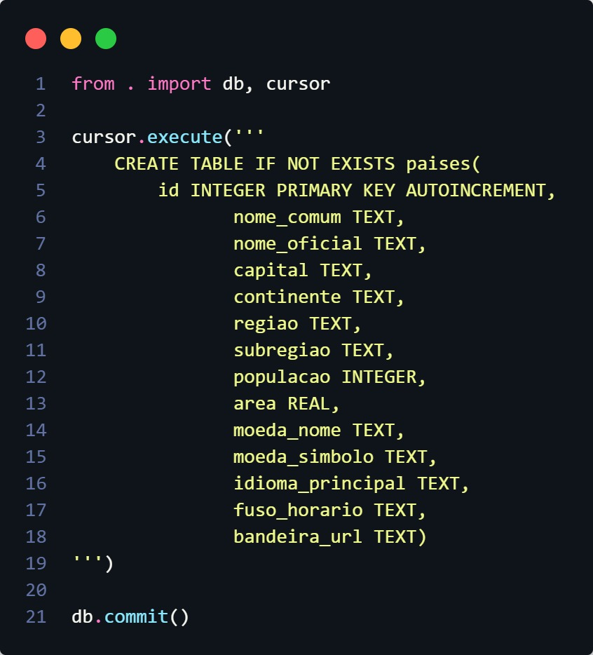

A tabela `paises` é criada no banco com todos os campos necessários para armazenar as informações completas de cada país.

### P4 - Função obter_paises(): Coleta de Input do Usuário
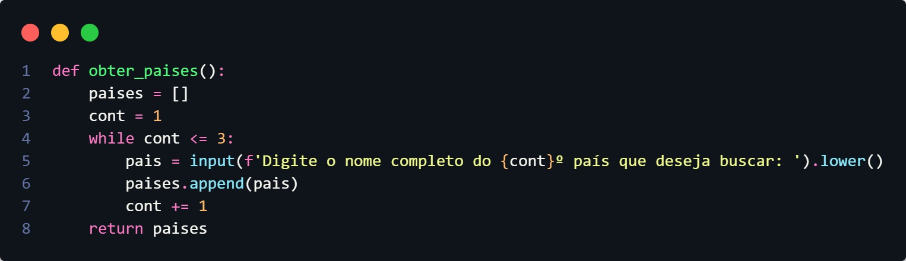

A função `obter_paises()` executa um loop (cont de 1 a 3) solicitando ao usuário o nome dos países desejados através de `input()`, armazenando cada entrada em uma lista e retornando essa lista.

### P5 - Lista de Países Coletados
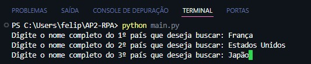

Resultado da função `obter_paises()` mostrando os 3 países que foram inseridos pelo usuário, armazenados na variável `paises_lista`.

### P6 - Função filtrar_dados()
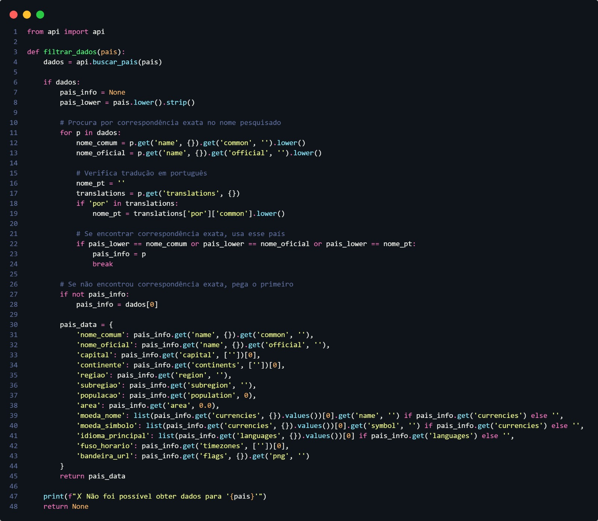

Para cada item da lista de países, é chamada a função `filtrar_dados()`, que por sua vez chama a função `buscar_pais()` para processar as informações.

### P7 - Função buscar_pais(): Requisição à API
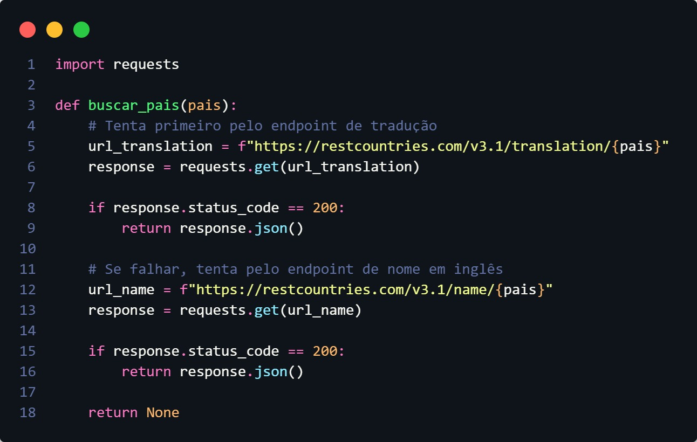

A função `buscar_pais()` faz uma requisição HTTP para a API REST Countries:
- Primeiro tenta o endpoint `/translation` para buscar o nome em português
- Se status 200: retorna os países encontrados
- Caso contrário: tenta o endpoint `/name` para buscar pelo nome em inglês

### P8 - Resposta JSON da API (Primeiro Resultado)
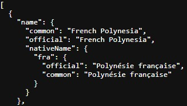

Quando a API retorna múltiplos países para uma busca (como "França"), o primeiro resultado pode não ser o país desejado. Aqui vemos um exemplo de JSON retornado pela API REST Countries, que será processado pela função `filtrar_dados()`.

### P9 - Algoritmo de Filtragem e Correspondência
O sistema implementa um algoritmo que percorre todos os países retornados e verifica correspondência exata entre:
- Nome buscado vs. `name.common` (nome comum em inglês)  
- Nome buscado vs. `name.official` (nome oficial)
- Nome buscado vs. `translations.por.common` (nome em português, se disponível)

### P10-P11 - País Correto Identificado
Quando encontra correspondência exata no loop, a variável `pais_info` recebe os dados do país correto. O algoritmo interrompe o loop (`break`) e processa apenas esse país específico. Os dados são organizados no dicionário `pais_data`.

### P12 - Função insert_pais(): Validação e Inserção no Banco
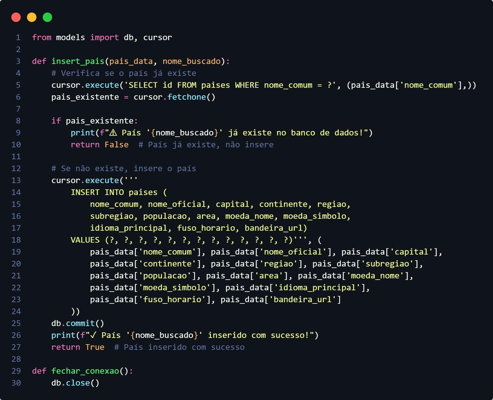

A função `insert_pais()` recebe dois parâmetros: `pais_data` (dicionário com dados extraídos) e `nome_buscado` (string original digitada pelo usuário). Primeiro executa:
```sql
SELECT id FROM paises WHERE nome_comum = ?
```
Se o país já existe: exibe "⚠ País já existe!" e retorna `False`  
Se não existe: executa `INSERT` com os 13 campos e retorna `True`

### P13 - Output Final: Países Inseridos
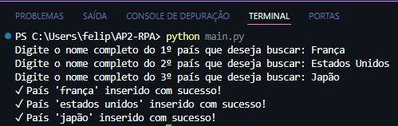

Mensagens de confirmação após todos os países serem processados e inseridos no banco de dados.

### P14-P15 - Resultado Final: Tabela Populada
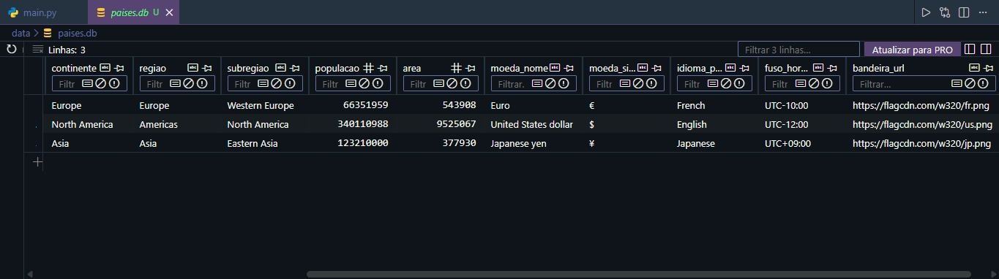

Visualização final da tabela `paises` no banco de dados com os 3 países buscados e todos os dados solicitados devidamente preenchidos.

---

## 🔄 Fluxo de Execução Resumido

```
graph TD
    A[Início - main.py] --> B[Criar/Conectar BD]
    B --> C[Criar Tabela países]
    C --> D[obter_paises()]
    D --> E[Lista de 3 países]
    E --> F[Para cada país: filtrar_dados()]
    F --> G[buscar_pais() - API Request]
    G --> H{Status 200?}
    H -->|Sim| I[Processar JSON]
    H -->|Não| J[Tentar endpoint /name]
    I --> K[Filtrar país correto]
    K --> L[insert_pais()]
    L --> M{Já existe?}
    M -->|Sim| N[Exibir: Já existe]
    M -->|Não| O[INSERT no BD]
    O --> P[Próximo país]
    P --> Q[Fechar conexão]
    Q --> R[Fim]
```

---

## 🔧 Configuração

## 🤝 Contribuindo

Contribuições são bem-vindas! Para contribuir:

1. Faça um fork do projeto
2. Crie uma branch para sua feature (`git checkout -b feature/MinhaFeature`)
3. Commit suas mudanças (`git commit -m 'Adiciona MinhaFeature'`)
4. Push para a branch (`git push origin feature/MinhaFeature`)
5. Abra um Pull Request

---

## 📄 Licença

Este projeto está sob a licença MIT. Veja o arquivo [LICENSE](LICENSE) para mais detalhes.

---

## 👤 Autores

**Felipe Viana** e **Ryan Rodrigues Cordeiro**

---

<div align="center">

⭐ Se este projeto foi útil, considere dar uma estrela!

</div>

